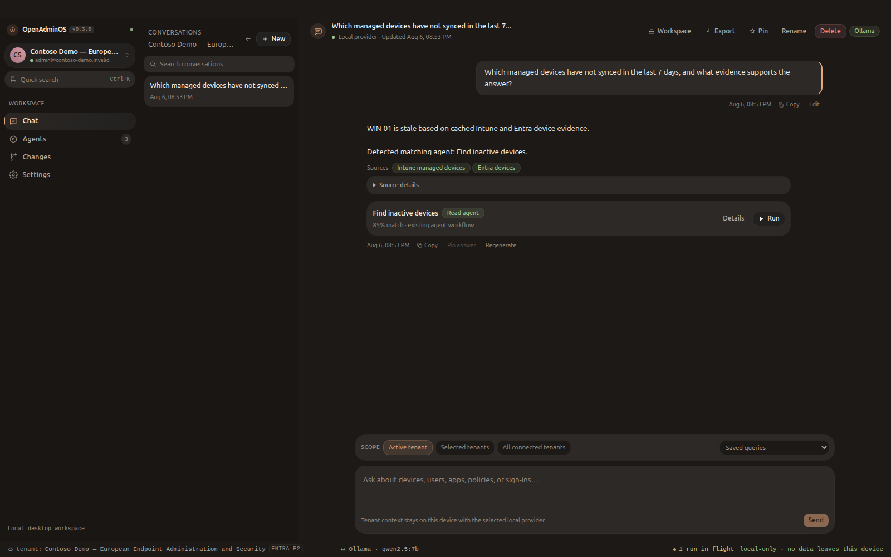

<div align="center">

<h1>OpenAdminOS</h1>

<p><strong>Open-source, local-first AI agents for Microsoft 365 admins.</strong></p>

<p>Run AI agents against your Microsoft 365 tenant from your own machine. Keep sensitive work local, avoid per-token costs with local models, and approve every change before it happens.</p>

[](https://github.com/OpenAdminOS/OpenAdminOS/actions/workflows/ci.yml)
[](https://github.com/OpenAdminOS/OpenAdminOS/actions/workflows/release.yml)
[](https://github.com/OpenAdminOS/OpenAdminOS/releases/latest)
[](https://github.com/OpenAdminOS/OpenAdminOS/releases)
[](LICENSE)
[](https://github.com/OpenAdminOS/OpenAdminOS/stargazers)
[](https://github.com/OpenAdminOS/OpenAdminOS/issues)
[](https://github.com/OpenAdminOS/OpenAdminOS/commits/main)

[**Download**](https://github.com/OpenAdminOS/OpenAdminOS/releases/latest) · [**Website**](https://openadminos.com) · [**Docs**](docs/SPEC.md) · [**Contributing**](CONTRIBUTING.md) · [**Changelog**](CHANGELOG.md)



</div>

---

## Why OpenAdminOS

- **Local-first by default.** Pick a local LLM (Ollama today; LM Studio planned) and tenant data plus prompts never leave the device. No tenant-content, prompt, run-result, analytics-event, or error-reporting telemetry. Switching to a hosted provider changes the trust banner honestly.
- **Every agent is auditable YAML.** No opaque code paths, no hidden Graph calls. Read the full pipeline — every Graph endpoint, every transform, every prompt — before you install.
- **Write agents always pause for typed diff confirmation.** No "trust this agent" toggle. Destructive changes require typing the phrase shown against the live diff (`type RETIRE 47 DEVICES to proceed`), every time.
- **No app registration required.** Sign in with your own admin identity via MSAL (Authorization Code + PKCE against the public Microsoft Graph CLI client). No client secrets, no consent dance with a third-party multi-tenant app.
- **Author agents in plain English.** Describe what you want; the local LLM drafts a manifest grounded in the JSON Schema; one click installs it.

## Download

| Platform | Asset |
|---|---|
| macOS (Apple Silicon) | [`OpenAdminOS-<version>-arm64.dmg`](https://github.com/OpenAdminOS/OpenAdminOS/releases/latest) — signed with Developer ID, notarized |
| Windows (x64) | [`OpenAdminOS-<version>-win-x64.exe`](https://github.com/OpenAdminOS/OpenAdminOS/releases/latest): code-signed NSIS installer, per-user install |
| From source | See [Quickstart](#quickstart) below |

---

## What's in the box (v0.2.5)

### Agent Templates — agents as YAML pipelines

Every shipped agent is a declarative `manifest.yaml`. No companion TypeScript needed. The runtime interprets the manifest top-to-bottom.

```yaml
descriptor:
  id: find-inactive-devices
  mode: read
  category: devices

skills:
  - id: load_devices
    format: graph
    settings: { method: GET, path: /deviceManagement/managedDevices, scopes: [...] }

  - id: by_age
    format: transform
    settings: { kind: group-by-age, source: "{{ load_devices.output }}", ... }

  - id: summarize
    format: llm
    settings: { prompt: "...", maxTokens: 220 }

definition:
  settings:
    - { id: retireDays, type: integer, default: 180 }
  result:
    summary: '{{ summarize.output.text | default("Summary unavailable.") }}'
```

**Step formats**: `graph` (read Microsoft Graph), `transform` (pure data shaping), `llm` (required — every agent invokes the model at least once), `map` (per-item sub-pipelines), `write` (emits one action per source item and pauses for typed phrase confirmation), and `connector` (declared outbound egress).

### Static QA gate

`npm run qa` validates every shipped manifest:
- **JSON Schema validation** of the YAML against [`schemas/agent-template.schema.json`](schemas/agent-template.schema.json).
- **Graph QA**: declared scopes are real, endpoints exist in the OpenAPI surface, `$select` fields exist on the resource, fixtures match the live schema. Uses the [`merill/msgraph`](https://github.com/merill/msgraph) skill — offline, no auth, no tenant calls.

A malformed manifest fails CI with a structured per-field diff.

### NL2Agent — describe an agent in English

The "Build your own Agent" button on the hub opens a guided flow. Type a description, the active LLM provider drafts a YAML manifest grounded in the schema and a worked example, the draft renders through the same Manifest Preview component as public agents, and Save & install routes you straight to the new agent's detail page. User-authored agents persist under `userData/agents/<slug>/` and appear in the merged registry without a restart.

### Trust model (non-negotiable)

- **Tenant data never leaves the device** when a local LLM is selected. No tenant-content, prompt, run-result, analytics-event, or error-reporting telemetry.
- **Write agents always pause for diff confirmation.** No "skip this prompt" toggle. Destructive operations require typed-phrase confirmation against the live diff, every time.
- **No tenant, no run.** The desktop shell remains available for browsing and drafting, but tenant-backed Chat, Graph refreshes, Changes, and agents pause for contextual connection. Agents never run against fallback demo data.
- **Graph writes follow the tenant binding.** Connect a real tenant and write agents call Microsoft Graph for real after you approve their plan. There is no separate global "enable writes" toggle — the typed-phrase confirmation per run is the only gate.

### What's shipped vs what's coming

| Area | Shipped in v0.2.5 | Coming next |
|---|---|---|
| Tenant connect | The Chat-first shell opens immediately. MSAL sign-in and grouped permission review appear contextually when an action needs a tenant. Multi-tenant switching, tenant groups, and explicit multi-tenant chat scope review are implemented. | Further tenant readiness polish as live pilots find gaps. |
| Intune Chat | Single-tenant chat, explicit multi-tenant read aggregation, saved queries, readiness preflight, local exports, and hosted-provider confirmations are implemented. | Broader answer panes and more resource-specific investigation views. |
| Workspaces | Single-tenant investigation workspaces with pinned evidence, notes, linked chats, linked runs, local instructions, and local dossier export are implemented. | More workspace import/export polish. |
| Agent registry | Agent Hub fetches `agents/index.json`, caches locally, version-pins installs, reviews scope-diff updates, and supports custom registry sources. | More maintainer workflow automation. |
| Build your own Agent | Guided manifest drafting, validation, repair, editable YAML review, local preflight, install, edit, export, and public "Share with community" issue intake are implemented. | More examples and better Graph QA messages. |
| Reference agents | The repo includes investigator, advisor, dashboard, cleanup, and one experimental script agent. | More agents after maintainer review. |
| Connectors | Outbound-only Teams, WhatsApp Web, Outlook, Slack, Discord, and Signal delivery are implemented. They send terminal run reports and do not read messages or inboxes. | ServiceNow and other enterprise connectors remain future work. |
| Schedules | Per-agent schedules use the OS scheduler on macOS and Windows after tenant sign-in. Scheduled runs still use the signed app and local state. | More schedule health and audit polish. |
| macOS menu bar | The signed app includes a menu-bar companion for active tenant/provider state, schedules, recent activity, and a compact read-only Intune Chat prompt. | Windows/Linux companion surfaces are not planned for 0.3. |
| LLM providers | Ollama, Apple Foundation Models on compatible macOS, and OpenAI through the local Codex CLI are implemented. | Anthropic via Claude Code CLI, LM Studio, and Azure OpenAI are planned for 0.3. |
| MXC sandbox | The Intune Device Posture Auditor uses `execution.kind: script` behind the experimental MXC setting. Normal community agents remain YAML templates. | Hardened sandbox policy before arbitrary community script agents. |
| Installers | macOS DMG/PKG builds are signed and notarized. Windows x64 ships a code-signed NSIS installer. Linux x64 AppImage, `.deb`, `.rpm`, and the apt repository are published. | Microsoft Store (AppX) distribution. |
| Local storage | SQLite stores chat, cache, schedules, Workspaces, runs, and local learning state. Secrets stay local through Electron secure storage and platform secret-store requirements. | Keychain hardening continues where platform support needs it. |

## Reference agents

| Agent | Category | Mode | What it does |
|---|---|---|---|
| `find-inactive-devices` | devices | read | Buckets managed devices by last-sync age. |
| `offboarding-agent` | devices | write | Correlates Intune sync + Entra sign-in to flag stale devices, retires them after typed confirmation. Open replacement for Microsoft's retired Intune Device Offboarding Agent. |
| `compliance-overview` | compliance | read | Counts devices by `complianceState`. |
| `os-update-posture` | updates | read | Tallies fleet by OS + OS version; surfaces end-of-life build risk via LLM summary. |
| `sign-in-failure-explainer` | policies | read | Correlates sign-in logs, Conditional Access, device state, and directory changes to explain failures. |
| `stale-guest-cleanup` | policies | write | Flags stale guests with LLM rationale and disables them only after typed confirmation. |

The repo currently indexes 14 agent and dashboard manifests under `agents/<slug>/manifest.yaml`. Read them — they are the documentation of what the runtime can do.

## Quickstart

```bash
# 1. Clone and install
git clone https://github.com/OpenAdminOS/OpenAdminOS.git
cd OpenAdminOS
npm install

# 2. Install Ollama and pull a model (required — every agent uses the LLM at least once)
brew install ollama && ollama serve &
ollama pull llama3.2:3b   # lightweight default; or pull whichever model you prefer

# 3. Run the desktop app
npm run dev

# 4. Verify everything
npm run typecheck   # types across the workspace
npm run qa          # JSON Schema + Graph QA
npm run build       # production bundle
```

On first launch, the app opens directly to Chat. You can browse the interface, choose a suggested question, and edit a local draft before connecting anything. Sending a question or starting an agent opens the permission review and Microsoft sign-in flow, then asks you to resume explicitly. Agent Hub refreshes the registry in the background, and agents only run with an active tenant.

## Architecture

```
apps/
  desktop/        Electron host (main + preload + Vite/React renderer)
web/              Next.js marketing site (openadminos.com)
agents/
  <slug>/         manifest.yaml + manifest.json (+ optional TS)
packages/
  agent-sdk/      Shared types (no runtime)
  runtime/        Agent Template interpreter, LLM providers, MSAL, Graph adapter
  qa-graph/       Offline manifest QA (schema + msgraph)
schemas/
  agent-template.schema.json    The canonical contract for manifest.yaml
docs/
  SPEC.md         Source of truth for product decisions
  mockups/        8 reference HTML mockups + design system tokens
```

Stack: TypeScript, npm workspaces + Turborepo, Electron 42, Vite + React + React Router, Tailwind, MSAL (`@azure/msal-node`), `js-yaml`, `ajv`. SQLite + `keytar` arrive in v0.2 with persistence + secrets hardening.

## Writing an agent by hand

```yaml
# yaml-language-server: $schema=../../schemas/agent-template.schema.json
descriptor:
  id: my-agent
  name: My Agent
  description: One sentence.
  version: 1.0.0
  author: { name: Your Name, handle: yourhandle }
  category: devices  # devices | apps | policies | compliance | updates
  mode: read

skills:
  - id: load_devices
    format: graph
    label: Load devices
    settings:
      method: GET
      path: /deviceManagement/managedDevices
      scopes: [DeviceManagementManagedDevices.Read.All]

  - id: summarize
    format: llm
    label: Summarize what we found
    settings:
      system: Be concise. Two sentences max.
      prompt: |-
        Total devices: {{ load_devices.output | size }}.
        Write an executive summary an admin can paste into a ticket.
      maxTokens: 180

definition:
  result:
    summary: '{{ summarize.output.text | default("Summary unavailable.") }}'
```

Every agent must include at least one `format: llm` step — the runtime enforces this and `npm run qa` flags violations. Use the LLM step's output as the run's headline summary.

Drop that at `agents/my-agent/manifest.yaml`, run `npm run qa`, and the agent shows up in the hub.

For the full schema, see [`schemas/agent-template.schema.json`](schemas/agent-template.schema.json) and [`schemas/README.md`](schemas/README.md). For deeper architecture, see [`docs/SPEC.md`](docs/SPEC.md).

## Contributing

See [`CONTRIBUTING.md`](CONTRIBUTING.md). Bug reports, feature requests, and agent contributions all welcome.

## License

MIT. See [`LICENSE`](LICENSE).

## Who's behind it

Free community project — sponsorships welcome, no paid tier planned for the platform itself.
